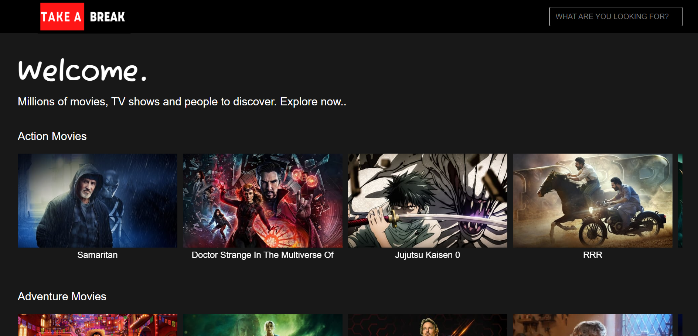
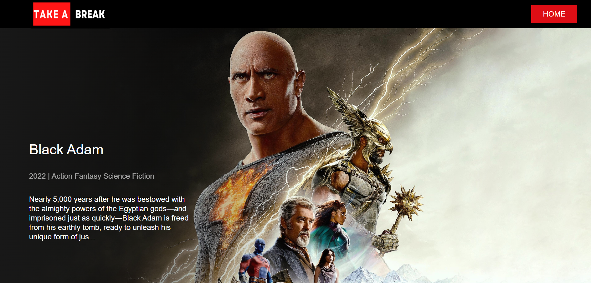
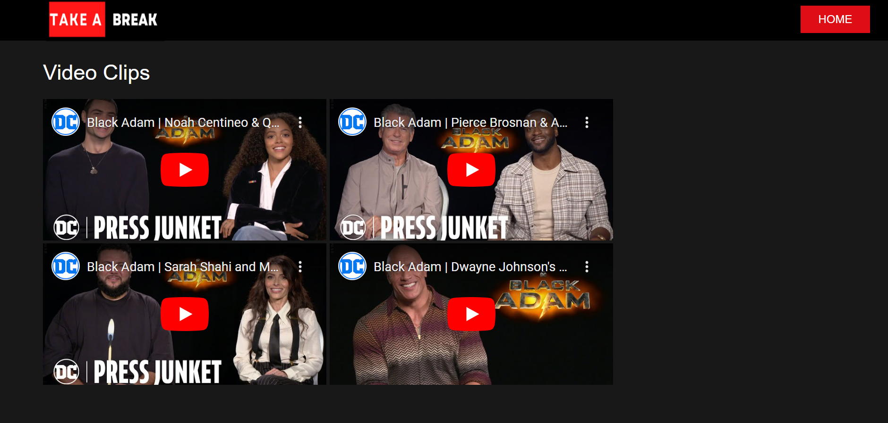
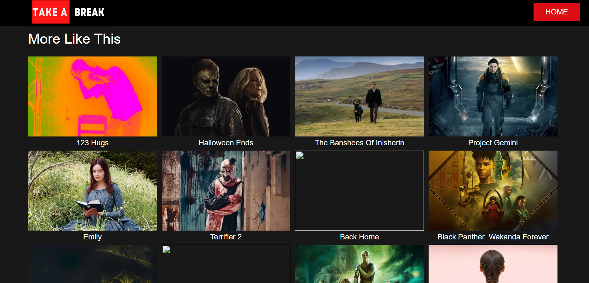

# Take-A-Break 
Take-a-Break is a web app built using Js, Node Js, Express Js, TMDb(The Movie Database) API and IFrame player API that allows searching of 10000+ movies and webseries and provides information about their plot, Genre, and Year in which it is released, along with high-quality trailer and other clips of movie fetched from youtube.

## Features

- Live previews
- Movies are classfied into different genres
- Will also get recommendations according to the movie genres
## Images

 

 

 

## To Be Added

[+] filter feature basis of genres
 
[+] optimise the video fetch method
 
[+] add rating of the movie using imbd
 
[+] add dark/light theme 
